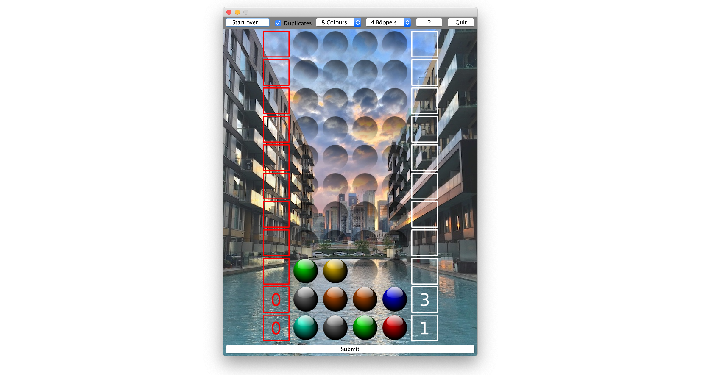

 Openmind

A code-breaking game.



## About

*Openmind* is a single-player open source implementation of the code-breaking board game [*Mastermind*](https://en.wikipedia.org/wiki/Mastermind_(board_game)).  
The player must infer a random colour combination, based on combinatoric clues. The game is won if the master combination is found within 11 guesses.

The following sections provide brief instructions on how to compile and use the software.

## Build & Run

### Requirements

 * JDK-8 or later and maven are required to build *Openmind*.

### Instructions

 * Direct launch:  
```bash
mvn exec:java
```

 * Launch from a reusable jar:  
```bash
mvn clean package
java -jar target/OpenMind.jar
```

## Playing

 * Hover your mouse over the lowest *Böppel*-row. Then scroll to select a colour.
 * Use the *Submit* button to enter a combination. Two numbers will appear:
   * Red: The amount of correctly coloured *Böppels*, on a correct spot.
   * White: The amount of remaining correctly coloured *Böppels*, on an incorrect spot.
 * You win, if you submit the secret master combination within 11 guesses.
 * You loose, if you run out of guesses.

## Trivia

[Wikipedia](https://en.wikipedia.org/wiki/Mastermind_(board_game)#Algorithms_and_strategies) says: (for 4 Böppels and 6 Colours)

> In 1977, Donald Knuth demonstrated that the codebreaker can solve the pattern in five moves or fewer [...]

## Contact / Pull Requests

 * Author: Maximilian Schiedermeier 
 * First release: August 2012
 * Github: Kartoffelquadrat
 * Webpage: https://www.cs.mcgill.ca/~mschie3
 * License: [GNU/GPL](https://www.gnu.org/licenses/gpl-3.0.en.html)
